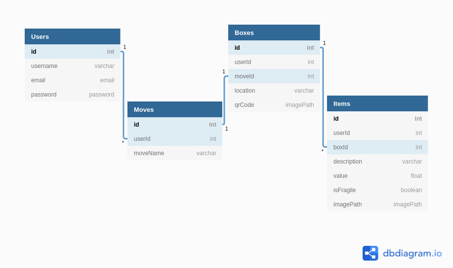

# Introduction

Hi, my name's Cheo.

This is my front-end capstone project.

## What is PackItUp

PackItUp is a moving/storage CRUD app created with React, HTML, CSS, Fetch API and json-server to help users keep track of what items they pack into boxes for moving/storage.

Initial design made with Figma and the entity relational diagram made with diagramdb.io.

Issue tickets follow [BDD](https://en.wikipedia.org/wiki/Behavior-driven_development#Behavioral_specifications), Behavior-Driven Development and use Github Project board to track issue lifecyles.

## Capabilities

- [x] User should be able to add/remove/update item(s).

- [x] User should be able to add/remove/update boxe(s).

- [x] User should be able to add/remove/update move(s).

- [x] User should be able to link/delink items from boxes.

- [x] User should not be able to modifiy other user's information.

- [x] User should be able to save their moves, boxes, items.

- [x] User should be able to authenticate.

- [x] User should only be able to add/remove/edit boxes, items if they are logged in.

## Endpoints

GET, POST, PUT, DELETE supported for the following routes

- /users
- /users/${id}
- /boxes
- /boxes/${id}
- /items
- /items/${id}

## Roadmap

- [ ] Encode item/box/move data as a QR code that can be printed out as a label for shipping.
- [ ] Add a complentary QR decoding, so user can scan QR on a box and get information about its contents (if user has authorization). User can limit what data 3rd parties (movers, storage management, ect) can see.

## Tech Stack

1. React
2. HTML
3. CSS
4. json-server

## ERD

Entity relationship diagram can be viewd at [diagram](https://dbdiagram.io/d/603cf260fcdcb6230b21ffe2) or latest screen capture below.

<details>
  
</details>

## Layout

Most up to day layout can be viewd at [my figma layout](https://www.figma.com/file/FVTItU8oORU8Mrihcd60Jj/PackItUp?node-id=39%3A0) or you can view latest screen capture below:

<details>
 
</details>

## Cloning

```bash
git clone git@github.com:CheoR/pack-it-up.git
npm install
```

## Testing Instructions

After forking the repo.

```bash

git fetch --all
git checkout <branch-name>
npm install
npm start

```

In another tab, cd into `api` and run

`json-server -p 8088 database.json`

Please note, as of right now, running the above command including `-w` would cause json-serve to crash if user chooses to create 4 or more objects at once through the `ADD` button.

## Contributing

Pull requests are welcome. For major changes, please open an issue first to discuss what you would like to change.

Please make sure to update tests as appropriate.

Please fill out the template for pulll request and label them appropriately.

## Acknowledgements

Thanks to NSS and everybody in my cohert that has helped me figure out problems when I was overthinking it.

## License

[MIT](https://choosealicense.com/licenses/mit/)
